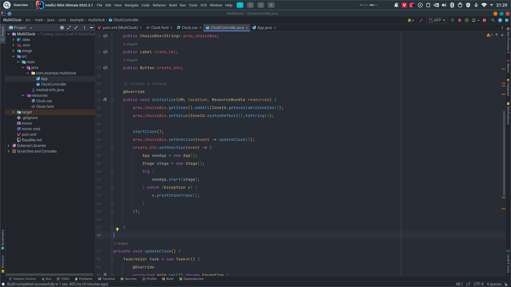
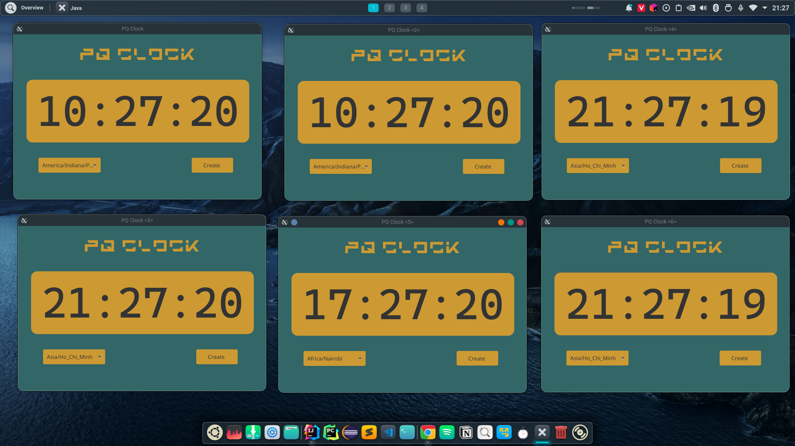

# MULTICLOCK - PQCLOCK - JAVAFX

## Introduction
This is an example of multithreading in javafx in order to create Multi Clock follow by time zone. 
### 1.1 Code image

### 1.2 MultiClock image

### 2.0 Usage
- Chooose Time Zone Fist.
- Click **Create** button to create an instance of application. 
